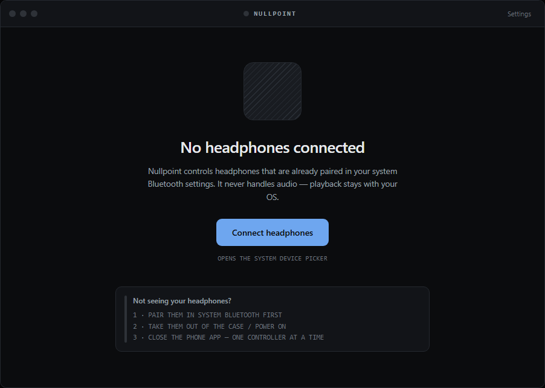
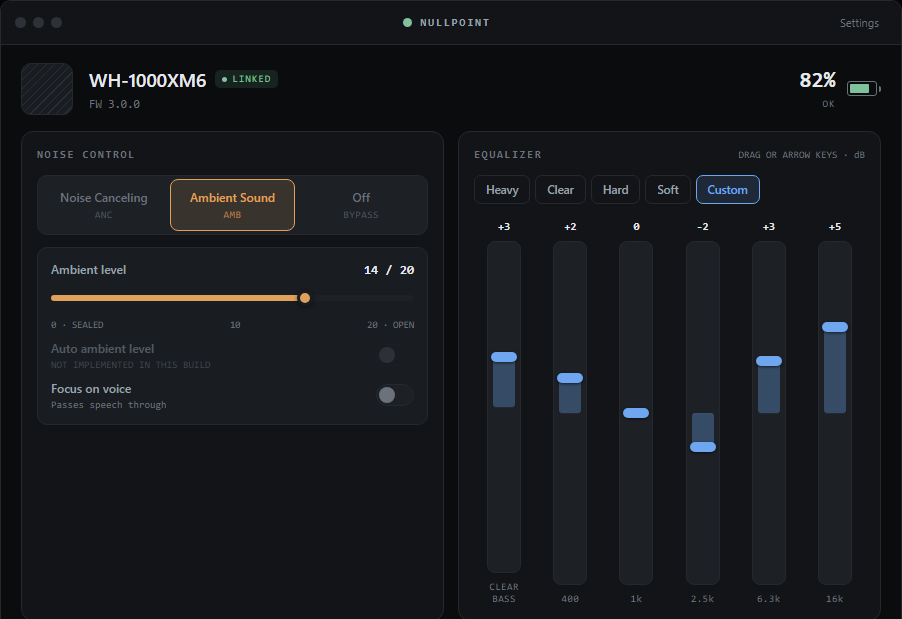

# Nullpoint

**[nullpoint.ali-dadashzadeh.ir](https://nullpoint.ali-dadashzadeh.ir)** — an unofficial desktop and web client for Sony headphones. The Windows / macOS / web app Sony never shipped.

> **Not affiliated with, endorsed by, or connected to Sony Group Corporation.** Model names (e.g. "WH-1000XM6") are used solely to identify compatible hardware. Protocol support is derived from public reverse-engineering work; features may break after firmware updates.

[**Download for Windows**](https://github.com/mehrshaad/nullpoint/releases/latest) · [**Open the web app**](https://nullpoint.ali-dadashzadeh.ir/app) · [Landing page](https://nullpoint.ali-dadashzadeh.ir)

## What this is

Sony's official "Sound Connect" app (Android/iOS only) talks to the headphones over a proprietary Bluetooth Classic RFCOMM channel to control ANC, ambient sound, EQ, and battery — audio itself is plain A2DP handled by the OS. Nullpoint reimplements that control channel for desktop and the web, using [Web Serial](https://developer.chrome.com/docs/capabilities/serial) to reach Bluetooth Classic RFCOMM (Web Bluetooth is BLE-only and can't do this).

**Features:** device detection, live battery, noise-canceling / ambient-sound mode with a continuous ambient level slider and focus-on-voice, and the equalizer with Sony's presets. Both equalizer layouts are supported — Clear Bass plus 5 bands, and the 10-band graphic EQ newer firmware reports. Changes made on the headphones themselves, or from your phone, appear in the app live.

**Playback and volume** for whichever device is playing, with a readout of the codec actually carrying audio. **Unlimited named EQ curves**, because the headset forgets a custom curve the moment you pick a preset. A **device panel** listing everything the headphones are paired with — which are connected, which one has the audio, and a button to connect or disconnect each. And **auto ambient level, Speak-to-Chat, DSEE Extreme, background music, cinema upmix, pause-on-removal, head gestures, auto power off and power off**, each appearing only when your headphones report it and left out entirely when they don't. Settings shows exactly what yours reported. The desktop app lives in the tray, can start at login without opening a window, and reconnects on its own — with **global hotkeys** and **noise-control switching from the tray menu**, so changing mode never needs a window. Speak-to-Chat can be **locked**, for headsets that keep switching it back on. Settings also carries a **protocol inspector** showing every frame on the wire, and a **binaural demo** that renders its own audio through an HRTF — Nullpoint never touches your music. Confirmed on a WH-1000XM6 (firmware 3.1.5) and a WH-CH720N.

## Screenshots

| Connect | Dashboard |
|---|---|
|  |  |

## Install

| | |
|---|---|
| **Windows** | [Download the installer](https://github.com/mehrshaad/nullpoint/releases/latest) (NSIS, 64-bit). Unsigned, so SmartScreen will warn on first run. |
| **macOS** | [Download the .dmg](https://github.com/mehrshaad/nullpoint/releases/latest) — Apple Silicon or Intel. Lives in the menu bar. Ad-hoc signed but not notarized, so right-click → Open the first time. |
| **Browser** | [Open the web app](https://nullpoint.ali-dadashzadeh.ir/app). Chrome, Edge, Opera or Arc on desktop; Safari and Firefox don't implement Web Serial. |

Either way, **pair the headphones in your OS Bluetooth settings first** — Nullpoint can't pair for you.

**Only one copy of Nullpoint can hold the settings channel.** If the desktop app is running in your tray, the web app can't connect, and vice versa. Music keeps playing either way — audio and settings travel separately.

## Getting started

Requires Node 22+ (pnpm 11 needs it) and pnpm.

```bash
pnpm install

pnpm run dev:web       # web app at http://localhost:5173 (landing at /, app at /app)
pnpm run dev:desktop   # Electron shell against a running dev:web

pnpm run build         # build all packages
pnpm run test          # protocol test suite
pnpm run typecheck

pnpm --filter @ssc/desktop run package:win   # build the Windows installer
pnpm --filter @ssc/desktop run icons        # regenerate every app/tray/PWA icon
pnpm --filter @ssc/desktop run art          # regenerate the installer artwork
```

## Architecture

A pnpm monorepo. The protocol implementation is transport-agnostic and framework-agnostic — it has no idea it's running in a browser.

```
packages/
  core/                   protocol only: framing, checksums, payload encode/decode,
                           the connect handshake, and the Headphones state machine.
                           Zero I/O — fully unit-tested without any hardware.
  transport-webserial/    the one real transport: Bluetooth Classic RFCOMM over the
                           Web Serial API. Works identically in a browser tab and in
                           Electron's Chromium renderer.
apps/
  web/                    React PWA — landing page, the app, and its screens.
  desktop/                Electron shell wrapping apps/web: tray, launch-at-login,
                           automatic serial-port selection, packaging.
scripts/                  icon generation: Chromium draws the vector, Pillow resamples
                           and packs the .ico containers by hand
```

Two details worth knowing if you work on this:

- **The desktop renderer is served over a custom `app://` scheme, not `file://`.** Vite emits absolute asset paths, and `navigator.serial` requires a secure context; registering the scheme as `secure` + `standard` solves both.
- **Packages consume each other through built `.d.ts` files**, so `pnpm -r run build` must run before `typecheck` on a clean checkout.

The wire protocol (frame markers, escaping, checksum, the MDR V2 command set) was ported from the reverse-engineering work in [`mos9527/SonyHeadphonesClient`](https://github.com/mos9527/SonyHeadphonesClient) and [`Plutoberth/SonyHeadphonesClient`](https://github.com/Plutoberth/SonyHeadphonesClient) (both MIT) — see [`NOTICE`](./NOTICE) for attribution and [`PROTOCOL.md`](./PROTOCOL.md) for byte-level protocol documentation, and [`PLAN.md`](./PLAN.md) for what is planned next.

## Design

The UI implements the Nullpoint design system checked into [`design/`](./design) — open `design/SoundConnect Desktop.dc.html` in a browser (with `design/support.js` alongside it) for the full token, component, and state spec.

## Multipoint

**Changing settings from your computer while your phone plays music works.** Audio multipoint and the settings channel are independent.

The one constraint is that the headphones hand out that settings channel to **one device at a time**. If another device is holding it, opening fails with `0x2740` ("only one usage of each socket address") — but the channel is reclaimable, and Nullpoint keeps retrying with backoff until it gets it, so this resolves without you doing anything. While Nullpoint holds it, the phone app won't be able to change settings, and vice versa. Audio to both devices is unaffected either way.

## Known limitations

- No code-signing identity. Windows SmartScreen warns on the installer, and the macOS build is ad-hoc signed rather than notarized.
- Only the single-battery reading is wired up, so earbuds won't show per-bud or case levels.
- Every control appears only if your headphones report the matching capability. On a WH-1000XM6 that means no connection-quality setting, because it doesn't advertise one — Settings shows exactly what yours reported.
- Devices that are paired but not currently connected don't report their device type, so their icon is guessed from the device name.
- These headphones hold **two** devices at once, so connecting a third from the device panel disconnects one of the existing pair. The panel says so when both slots are in use, and a refused switch reports why.
- The connected-device panel appears only if your headphones report Protocol V2 Table 2 support, and is silently absent if they don't.
- See [`PLAN.md`](./PLAN.md) for what's planned next, including Adaptive Sound Control.
- Confirmed on **WH-1000XM6** (firmware 3.1.5) and **WH-CH720N**. Other Sony models use the same protocol and should work, but are unverified — [reports welcome](https://github.com/mehrshaad/nullpoint/issues).

## License

Apache-2.0 — see [`LICENSE`](./LICENSE). Protocol-port attribution in [`NOTICE`](./NOTICE).
